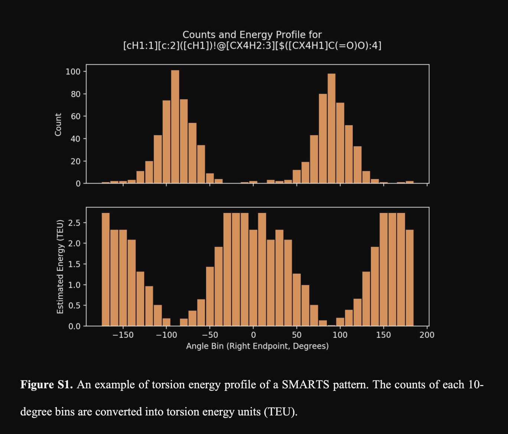
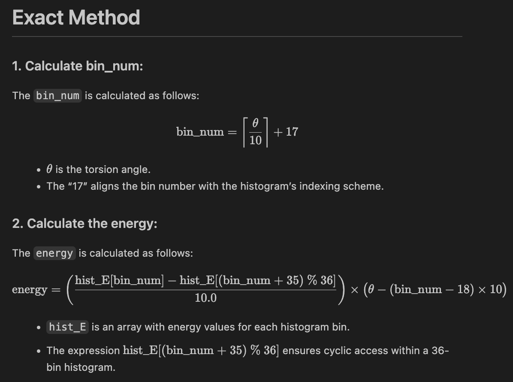
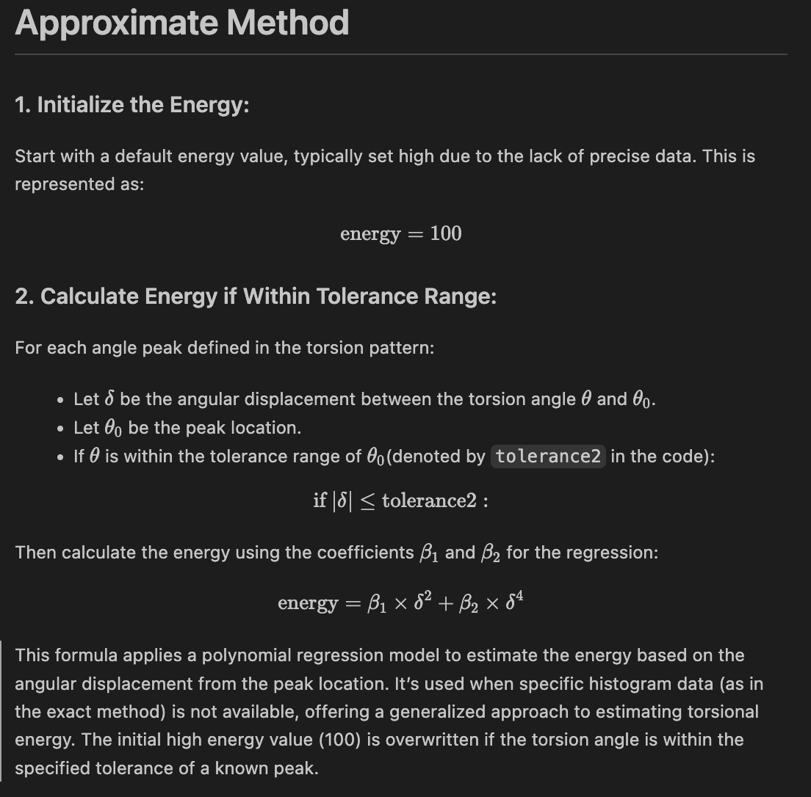

so tp_match gets ALL the possible smarts from the torsion XML 
as smarts, then it does this 

`matches = mol.GetSubstructMatches(Chem.MolFromSmarts(smarts))
`

so the list of tuple matches comes from whatever our mol can match with `GetSubstructMatches` with `smarts` (which is made into a mol object)

sometimes the matches are empty, when that happens, tp_match() moves on 

however when TL_lookup is called, it starts an i incrementer that it will be feed to the tp_match() function. 

so, when the matches are empty, bi is never written by tp_match, but the i incrementer is still incremented.

when the matches are not empty, bi is written by tp_match, and the i incrementer is still incremented.

so the first j values we get from tp_match is the first match. 

`tp_match()` is asking what is the first xml smarts that will fit your molecule? then it will save that information. 

TL_lookup has logic for incrementing i, it wants to increment first by the non-general torsions, the specific ones. 

then the general ones. 

once it has done that, it has all the torsions that is possible to find for your molecule based on 

`matches = mol.GetSubstructMatches(Chem.MolFromSmarts(smarts))
`

(in theory, at least)

this is `bond_info`, so the first molecule gets 40 matches like this.

weird stuff can happen though, for instance the first smarts match is in the first and second list in bond_info, like this (look at the first tuple!) 

`Bond 0: [[18, 23, 24, 26], -179.99349340619358, '[a:1][a:2]!@[NX3:3][!#1:4]', 'specific', 'exact', 0.0002475159675178751, -0.011782303262766858, 0.012522277005268923, False, 175]
`

`Number of items in bond: 10
` (its the same, just a sanity check)

`Bond 1: [[22, 23, 24, 26], 0.44585819818713934, '[a:1][a:2]!@[NX3:3][!#1:4]', 'specific', 'exact', 0.04286473150482756, 0.029821344396192107, 0.056205983956472805, False, 175]
`

As we know graphically, either 18/22 are just fine matches for that pattern, that's not the issue. but are both of these in our output? 

```
ZINC000191583186,5.621730380254799,5.0724614891320625,nan,4,1.5149015019717655,1.4720415536611848,1.5610762283636115,"[15, 13, 16, 17]",-79.9987689699916,[!#1:1][CX4:2]!@[CX4:3][!#1:4],specific,exact,False,8,1.1629499135175863,1.0138763654377367,nan,"[16, 13, 10, 6]",-159.99678602096148,[*:1]~[CX4:2]!@[NX4:3]~[*:4],general,exact,False,7,1.1627673850560352,1.0137656230416119,nan,"[8, 6, 10, 13]",-159.9987199068972,[*:1]~[CX4:2]!@[NX4:3]~[*:4],general,exact,False,5,1.0408019376654853,0.8903165100240227,1.2452601666364487,"[19, 18, 17, 16]",0.27343903595492747,[a:1][c:2]!@[CX4H2:3][CX4:4],specific,exact,False,3,0.34528595288770225,0.33914296320237924,0.3514895675876632,"[4, 5, 6, 8]",59.99348627709831,[!#1:1][CX4:2]!@[CX4:3][!#1:4],specific,exact,False,1,0.34522247008497436,0.33908125045590787,0.3514242249136928,"[5, 6, 8, 9]",60.00831008335173,[!#1:1][CX4:2]!@[CX4:3][!#1:4],specific,exact,False,0,
```

```
0.04286473150482756,0.029821344396192107,0.056205983956472805,"[22, 23, 24, 26]",0.44585819818713934,[a:1][a:2]!@[NX3:3][!#1:4],specific,exact,False,6,
```
```
0.006707819673103034,-0.022299325452382023,0.037155275308878924,"[27, 4, 5, 6]",89.99270199528776,[a:1][c:2]!@[CX4H2:3][CX4:4],specific,exact,False,2,0.00022866789331876802,-0.0032847956345907203,0.0037593249345717616,"[13, 16, 17, 18]",-179.997919361389,[!#1:1][CX4H2:2]!@[CX4H2:3][!#1:4],specific,exact,False
```

I've seperated out the line containing the tuple match for [22, 23, 24, 26]. The other match is not in the CSV. It has to be filtered somehow. 

Why is the other tuple not reported? We know tp_match will throw away hydrogens so let's just check that 

remember we care about: `[22, 23, 24, 26]` (the match) and `[18, 23, 24, 26]` (ignored match) 

here's what our code said before: 

``Matching atom indices via Chem.MolFromSmarts: (18, 23, 24, 26)``

``Matching atom indices found from df_1: [22, 23, 24, 26], Origin: mol2``

``Key, MOL2: ZINC000191583186``

![Alt text][def]

[def]: image.png

We are ignoring the default match. This is actually also the first match that his approach finds (both have the same torsion index, in the raw output the ignored one is first). 

Is the highlighting wrong? Kind of, in the sense that it should highlight more: [a:1][a:2]!@[NX3:3][!#1:4] specifies a structural pattern where two arbitrary atoms are connected by a non-ring bond to a nitrogen atom with three bonds, which is in turn connected to any atom that is not hydrogen.

Yes nitrogen actually has *4 bonds*, because it is charged - but that doesn't matter to how SMARTs work, see the quote below. Picking either oxygen isn't the issue here, either. And yes, in Maestro, mol2 appears to actually have five bonds because it keeps both oxygen bonds as =O. But, rdkit is not going to depict the molecule as such based on his mol2 supplying function (for whatever reason). rdkit has an internal mol object that he somehow gets with this code and when you draw the molecule, it is going to draw it like this, everytime. 

Also it is worth clarifying that "bonds" in SMARTs/rdkit (the X notation) are not "real" bonds, theyre counting connectivity, not electron sharing. 

"In SMARTS, a double bond is counted as a single connection or bond for the purpose of the X notation. The X notation counts the number of adjacent atoms, not the number of bonding electrons. Therefore, whether the bond is a single, double, or triple bond, it still counts as one bond in terms of X"

So the highlight is fine.  real issue is we should have *4 matches here*. We should have: 

either 18 or 22 - then 23, 24 - either 25, or 26. all of these should fit. tp_match only does 2 internal filtering step in its function prior to the stuff that happens in TL_lookup, and that is checking  how long the match is and the amount of hydrogens.

```py    

for match in matches:
    if len(match) > 4:
        continue
    if (
        mol.GetAtomWithIdx(match[0]).GetSymbol() == "H"
        or mol.GetAtomWithIdx(match[3]).GetSymbol() == "H"
        ):
        continue
        
```

`continue` just skips it. he only allows 4 atoms to be considered (good) and that the terminal atoms (0 and 3 here) are H, which is good. 

The next bond he fined is already a different pattern entirely. So we've moved on from a SMARTs that should match more (field 3, after the energy).  

`Bond 2: [[9, 8, 6, 10], -59.99827151843282,'[OX2:1][CX4:2]!@[CX4:3][N:4]', 'specific', 'exact', 0.01598285324959059, -0.03286993469690691, 0.06738657722312391, False, 252]`

(remember we start at Bond 0)

So now we have two issues: why do we only have those two matches and not the 4, and why do we only pick one of these energies to report? 

In terms of why not 4 matches? I don't get it. To me it *should* have 4. 

In terms of why is 1 reported and not the other? That has to do with how `TL_lookup` works. `TL_lookup` checks for several things (as far as I understand) before finalizing the data that we will write in the csv. It's the most confusing part of the code, so what follows is me figuring out in a stream of conciousness way with print statements.

1. Before TL_lookup, we know that tp_match() is checking length and termiinal hydrogens. Our match passes this.
   
2. Internal Bond Order:

```python    
for bond in bond_info:
    if bond[0][1] > bond[0][2]:
        bond[0].reverse()
        bond.append(True)
    else:
        bond.append(False)
```

It cares about the relative ordering of bonds in a tuple. If we add some print statements to `bond` , `bond[0][1]` and `bond[0][2]`, this will make more sense. 

```python
for index, bond in enumerate(bond_info):
    print(f"Bond {index}: {bond}")
```
`Bond 0: [[18, 23, 24, 26], -179.99349340619358, '[a:1][a:2]!@[NX3:3][!#1:4]', 'specific', 'exact', 0.0002475159675178751, -0.011782303262766858, 0.012522277005268923, False, 175]
`

Since bond_info is lists of lists, bond is a list of lists. This then makes `bond[0]` the first element within it, and `bond[0][1]` `bond[0][2]` the 2nd and 3rd elements (python counts from 0).

`bond[0][1]: 23` 

`bond[0][2]: 24`

I am not sure *why* he is checking this but both [22, 23, 24, 26] (the match) and [18, 23, 24, 26] (disfavored match) would pass (both would be 23 and 24). And in either case, he just reverses the bond. I have to guess this is something to help with removing duplicates (because it doesnt matter which order of atoms you consider for the dihedral angle). It's not relevant here though. 

(Note from the future, me reviewing this: from here I can't easily number what his code is doing, but I can show you)

Then his code starts doing something strange which I think is unintended. 

```python

bond_info_red = [bond_info[0]]
for j in range(1, len(bond_info)):
    atom_0 = bond_info[j][0][0]
    atom_1 = bond_info[j][0][1]
    atom_2 = bond_info[j][0][2]
    atom_3 = bond_info[j][0][3]
    unmatched = True
    for k in range(len(bond_info_red)):
        if (
            bond_info_red[k][0][0] == atom_0
            and bond_info_red[k][0][1] == atom_1
            and bond_info_red[k][0][2] == atom_2
            and bond_info_red[k][0][3] == atom_3
            ):
            unmatched = False
            if bond_info[j][9] < bond_info_red[k][9]:
                bond_info_red[k] = bond_info[j]
                break
            if unmatched:
                bond_info_red.append(bond_info[j])
```
`bond_info_red = [bond_info[0]]` is another nested list structure. Here's what it looks like 

bond_info_red (which is bond_info[0] inside a list): `[[[18, 23, 24, 26], -179.99349340619358, '[a:1][a:2]!@[NX3:3][!#1:4]', 'specific', 'exact', 0.0002475159675178751, -0.011782303262766858, 0.012522277005268923, False, 175, False]]`

The weird part comes in here:

            for j in range(1, len(bond_info)):

If you print it, you'll find that this range is kind of odd: 

    print(f"loop range: {range(1, len(bond_info))}")  
    
loop range: range(1, 40)

So when he loops through with j, it's going to start at 1 because that is how the range operator works. It's inclusive of the first digit and exclusive of the last digit. 
```python
for j in range(1, len(bond_info)):  # note this is bond info
    if j == 1:
        print(f"First element being processed: {bond_info[j]}")
```
`First element being processed: [[22, 23, 24, 26], 0.44585819818713934, '[a:1][a:2]!@[NX3:3][!#1:4]', 'specific', 'exact', 0.04286473150482756, 0.029821344396192107, 0.056205983956472805, False, 175, False]
`

So it's going to skip j = 0 here:

```python
bond_info_red = [bond_info[0]]
    for j in range(1, len(bond_info)):
        atom_0 = bond_info[j][0][0]
        atom_1 = bond_info[j][0][1]
        atom_2 = bond_info[j][0][2]
        atom_3 = bond_info[j][0][3]
```
You can add a print statement to see what that is definitely happening:

```python
print(f"Element being skipped: {bond_info[0]}")
```
`element being skipped: [[18, 23, 24, 26], -179.99349340619358, '[a:1][a:2]!@[NX3:3][!#1:4]', 'specific', 'exact', 0.0002475159675178751, -0.011782303262766858, 0.012522277005268923, False, 175, False]
`

This is weird enough and I can't tell if he meant to do that. If you add print statements for j and the atoms there, it confirms this:

```python
print(f"Element being skipped: {bond_info[0]}")
for j in range(1, len(bond_info)):  # note this is bond info
    if j == 1:
        print(f"First element being processed: {bond_info[j]}")
        print()
    atom_0 = bond_info[j][0][0]
    atom_1 = bond_info[j][0][1]
    atom_2 = bond_info[j][0][2]
    atom_3 = bond_info[j][0][3]
    print(f"j: {j}")
    print(f"atom_0: {atom_0}")
    print(f"atom_1: {atom_1}")
    print(f"atom_2: {atom_2}")
    print(f"atom_3: {atom_3}")
```
`Element being skipped: [[18, 23, 24, 26], -179.99349340619358, '[a:1][a:2]!@[NX3:3][!#1:4]', 'specific', 'exact', 0.0002475159675178751, -0.011782303262766858, 0.012522277005268923, False, 175, False]
`

`First element being processed: [[22, 23, 24, 26], 0.44585819818713934, '[a:1][a:2]!@[NX3:3][!#1:4]', 'specific', 'exact', 0.04286473150482756, 0.029821344396192107, 0.056205983956472805, False, 175, False]
`


    j: 1
    atom_0: 22
    atom_1: 23
    atom_2: 24
    atom_3: 26

`j` really does start at 1, and it really does skip processing the very first match. 

The next part of the code, *does not follow this convention*, which makes me think there is an off by 1 error. 

```python
    bond_info_red = [bond_info[0]]
        for j in range(1, len(bond_info)):
            atom_0 = bond_info[j][0][0]
            atom_1 = bond_info[j][0][1]
            atom_2 = bond_info[j][0][2]
            atom_3 = bond_info[j][0][3]
            unmatched = True
            for k in range(len(bond_info_red)):
                if (
                    bond_info_red[k][0][0] == atom_0
                    and bond_info_red[k][0][1] == atom_1
                    and bond_info_red[k][0][2] == atom_2
                    and bond_info_red[k][0][3] == atom_3
                ):
                    unmatched = False
                    if bond_info[j][9] < bond_info_red[k][9]:
                        bond_info_red[k] = bond_info[j]
                        break
            if unmatched:
                bond_info_red.append(bond_info[j])
```

Once we get to the `for k in range(len(bond_info_red))` we are no longer skipping element zero, we are going through 0 to 39 (since len = 40). 

What's happening here is that he sets unmatched = True in the j loop, as well as setting atom_0,1,2,3 to the second element (or first, depending on if you count like python in your head). Then he's asking "Do any of the tuple indices of bond_info_red match the ones I just made in bond_info (which can't be element 0, the first match)?" If they do, update 'unmatched = False'. Then find the one with the lower [9] index. 

This took me forever to understand but the 9 index is "Torsion Index". I am not sure what best to call it, but essentially he has an order for going through the XML of torsion data/smarts and he wants to choose the most "relevant" torsion and that what his order of searching claims to do. This is that '175' number we see for the match we're thinking about. It took 175 matches of decreasing "relevance" to find that match. I can't trigger it here (regardless of the potential off by 1 error, because both of these matches appear at 175). However here's an example of print statement trigger for this: 

```py
    for k in range(len(bond_info_red)):
                # this is bond info red
                # this loop is not going to skip, k = 0 to start
                # print(f"j: {j}")
                # print(f"k: {k}")
                # does this introduce an off by 1 error?
                if (
                    bond_info_red[k][0][0] == atom_0
                    and bond_info_red[k][0][1] == atom_1
                    and bond_info_red[k][0][2] == atom_2
                    and bond_info_red[k][0][3] == atom_3
                ):
                    unmatched = False
                    print(
                        f"j: {j}, bond_info[j][0]: {bond_info[j][0]}, bond_info[j][9]: {bond_info[j][9]}")
                    print(
                        f"k: {k}, bond_info_red[k][0]: {bond_info_red[k][0]}, bond_info_red[k][9]: {bond_info_red[k][9]}"
                    )
                    if bond_info[j][9] < bond_info_red[k][9]:
                        # note this compared to bond_info
                        print(
                            f"bond info compared to bond_info_red: {bond_info[j][9]} < {bond_info_red[k][9]}"
                        )
                        bond_info_red[k] = bond_info[j]
                        break
                    else:
                        print(
                            f"bond info compared to bond_info_red: {bond_info[j][9]} >= {bond_info_red[k][9]}"
                        )
```

For this mol, it is gonna trigger on j = 7 

    j: 7
    atom_0: 10
    atom_1: 6
    atom_2: 8
    atom_3: 9
    j: 7, bond_info[j][0]: [10, 6, 8, 9], bond_info[j][9]: 257
    k: 2, bond_info_red[k][0]: [10, 6, 8, 9], bond_info_red[k][9]: 252
    bond info compared to bond_info_red: 257 >= 252

j = 7 will then be bond 7 (again, because j starts at 1):

    Bond 7: [[9, 8, 6, 10], -59.99827151843282, '[!#1:1][CX4:2]!@[CX4:3][!#1:4]', 'specific', 'exact', 0.35087419947369325, 0.3446748133855796, 0.3571353082182267, False, 257]

You'll notice that the indices are actually flipped, which is because 8/6 aren't in the ascending order he wants. So it would have been reversed to 10, 6, 8, 9. 

It says j = 7 is a duplicate of k = 2 **(note my analysis of the off by 1 is wrong somehow, bc k =2 =bond2 starting counting for bond0, i cant make sense of that right now, ill look into it)**

    Bond 2: [[9, 8, 6, 10], -59.99827151843282, '[OX2:1][CX4:2]!@[CX4:3][N:4]', 'specific', 'exact', 0.01598285324959059, -0.03286993469690691, 0.06738657722312391, False, 252]

Since bond_info has a greater tp_index than bond_info_red, we don't do anything (is that really what he intended?). I guess he wants to keep the highest index value. This is very confusing because earlier he does this (those are my comments):

```py

    def tp_match(tp, hc, j, mol, pos, bi):
    def TL_lookup(mol):
        positions = mol.GetConformer().GetPositions()
        bond_info = []
        i = 0  #NOTE: that i is used where 'j' goes in tp_match() 
        # iterate overall hierarchyClasses
        for HC in root.findall("hierarchyClass"):
            # only iterate over hierarchyClasses that are not GG
            if HC.get("name") != "GG":
                # for hierarchyClass != GG, iterate over torsionRules
                # this makes them "specific"
                # its going to try to match them against every torsionRules, which can't work, but i increments everytime
                for TP in HC.iter("torsionRule"):
                    tp_match(TP, "specific", i, mol, positions, bond_info)
                    # NOTE: i is used in tp_match() as j
                    # in terms of priority, this is how "specific" goes first, it has a lower i/j value
                    i += 1
        # for hierarchyClass == GG, iterate over torsionRules like before as "general", but with a higher i/j value
        for TP in root.find("hierarchyClass[@name='GG']").iter("torsionRule"):
            tp_match(TP, "general", i, mol, positions, bond_info)
            i += 1
```

For what it's worth copilot agrees with my comments:

"Yes, your comments are correct. Here's a breakdown of what's happening:

1. The function `TL_lookup(mol)` is called with a molecule object as an argument.

2. The variable `i` is initialized to 0. This variable is used to keep track of the order in which the torsion rules are processed.

3. The function first iterates over all `hierarchyClass` elements in the root of the XML document. For each `hierarchyClass` that is not named "GG", it iterates over its `torsionRule` elements. For each `torsionRule`, it calls the `tp_match` function with "specific" as the hierarchy class and `i` as the order. After each call to `tp_match`, it increments `i` by 1.

4. After processing all `hierarchyClass` elements that are not named "GG", the function finds the `hierarchyClass` that is named "GG" and iterates over its `torsionRule` elements. For each `torsionRule`, it calls the `tp_match` function with "general" as the hierarchy class and `i` as the order. After each call to `tp_match`, it increments `i` by 1.

So, your comments are correct. The `i` variable is used to keep track of the order in which the torsion rules are processed, and it is incremented each time a torsion rule is processed. The "specific" torsion rules are processed before the "general" ones, which is why they have lower `i` values."

I am almost positive he wants to keep the lower numbers, not the higher numbers. But either way, this *also* does not explain why our match is retained. 

So, let's get to the final part of the loop. This is where this match is switched.

```py
b_i_r = [bond_info_red[0]]
for j in range(1, len(bond_info_red)):
    atom_1 = bond_info_red[j][0][1]
    atom_2 = bond_info_red[j][0][2]
    unmatched = True
    for k in range(len(b_i_r)):
        if b_i_r[k][0][1] == atom_1 and b_i_r[k][0][2] == atom_2:
            unmatched = False
            if bond_info_red[j][3][0] > b_i_r[k][3][0] or       (bond_info_red[j][5] > b_i_r[k][5]
                and bond_info_red[j][3][0] == b_i_r[k][3][0]
            ):
                b_i_r[k] = bond_info_red[j]
                break
    if unmatched:
        b_i_r.append(bond_info_red[j])
for bond in b_i_r:
    if bond[10]:
        bond[0].reverse()
return TP_list(
    [bond[0] for bond in b_i_r],
    [bond[1] for bond in b_i_r],
    [bond[2] for bond in b_i_r],
    [bond[3] for bond in b_i_r],
    [bond[4] for bond in b_i_r],
    [bond[5] for bond in b_i_r],
    [bond[6] for bond in b_i_r],
    [bond[7] for bond in b_i_r],
    [bond[8] for bond in b_i_r])
```
b_i_r is set as bond_info_red analogusly to before. We again have this strange off by 1 (in my opinion) issue. We again see if the connecting atoms of our bond (that which defines the torsion) in bond_info_red, are in b_i_r, but we do not consider the 0th element of bond_info_red (for whatever reason). If that bond repeats, we check this: 
```py
if  bond_info_red[j][3][0] > b_i_r[k][3][0] or (
    bond_info_red[j][5] > b_i_r[k][5]
    and bond_info_red[j][3][0] == b_i_r[k][3][0]):
        b_i_r[k] = bond_info_red[j]
```

If we `print b_i_r[0]` and the terms in the if logic. we can see what's roughly going on: 

`b_i_r[0]: [[18, 23, 24, 26], -179.99349340619358, '[a:1][a:2]!@[NX3:3][!#1:4]', 'specific', 'exact', 0.0002475159675178751, -0.011782303262766858, 0.012522277005268923, False, 175, False]
`

`b_i_r[0][3][0]: s
`

`b_i_r[0][5]: 0.0002475159675178751
`

The `[0][3][0]` is the first letter of the type of torsion it was defined as, "specific" or "generic". It's taking the first letter so it's "s" or "g"

The `[0][5]` is the energy associated with this torsion. 

So to simplify what's going on:

First we compare which one is more specific, or if they are equally specific, which does one have more energy?

If that's true, we take that one

b_i_r is updated to be the value in bond_info_red. 

This is then what is ultimately returned to TP_list, and TP_list holds the data for the csv. This is where we finally switch between the two possibilities, by using this print statement: 

```py
for j in range(1, len(bond_info_red)):
    atom_1 = bond_info_red[j][0][1]
    atom_2 = bond_info_red[j][0][2]
    unmatched = True
        for k in range(len(b_i_r)):
            if b_i_r[k][0][1] == atom_1 and b_i_r[k][0][2] == atom_2:
                unmatched = False
                print()
                print(f"Match found with b_i_r: {b_i_r[k][0]} and bond_info_red element: {bond_info_red[j][0]}")
                if bond_info_red[j][3][0] > b_i_r[k][3][0] or (
                        bond_info_red[j][5] > b_i_r[k][5]
                        and bond_info_red[j][3][0] == b_i_r[k][3][0]
                    ):
                    print(f"CONDITION MATCHED")
                    print(f"Comparing 'bond_info_red[{j}][3][0]': ({bond_info_red[j][3][0]}) > 'b_i_r[{k}][3][0]': ({b_i_r[k][3][0]}) or '(bond_info_red[{j}][5]': ({bond_info_red[j][5]}) > 'b_i_r[{k}][5]': ({b_i_r[k][5]}) and 'bond_info_red[{j}][3][0]': ({bond_info_red[j][3][0]}) == 'b_i_r[{k}][3][0]:' ({b_i_r[k][3][0]}))")
                    print()
                    print(f"Replacing b_i_r element {k} with bond_info_red element {j}")
                    print(f"b_i_r element {k}: {b_i_r[k]}")
                    print(f"bond_info_red element {j}: {bond_info_red[j]}")
                    b_i_r[k] = bond_info_red[j]
                    break
        if unmatched:
                b_i_r.append(bond_info_red[j])
```

`Match found with b_i_r: [18, 23, 24, 26] and bond_info_red element: [22, 23, 24, 26]`

`CONDITION MATCHED`

`Comparing 'bond_info_red[1][3][0]': (s) > 'b_i_r[0][3][0]': (s)` 

`or` 

`'(bond_info_red[1][5]': (0.04286473150482756) > 'b_i_r[0][5]': (0.0002475159675178751) and 'bond_info_red[1][3][0]': (s) == 'b_i_r[0][3][0]:' (s))`


Both are specific (s) but but bond_info_red has higher energy. So we choose that one. 

From here, nothing much happens in the csv writing steps except summing the energies and making sure the name of the molecule is attached. 

I more or less get what's happening except for that off by 1 issue, that I just don't understand yet. I can't imagine he did that twice by accident. 

I don't really follow his logic of why you would keep only one of these matches. Lets go back to our image for a second: 

![Alt text][def]

[def]: image.png

Both [18, 23, 24, 26] and [22, 23, 24, 26] are perfectly reasonable matches that describe two different torsion energies. Why wouldn't you get all their energies? I don't get what chemistry flaw begins to exist if we consider all of these torsions. I would guess the answer lies somewhere in the math used to get these energies. This is also in tp_match(). I've qupted the paper below. 

I would prefer to get all the unique torsion and account for all of them. I don't get why he would filter out this match in particular. 

However, regardless of how I'd approach the selection of torsions, what I can't replicate is access to his database of mol2 file that were docked against D4. If I could have that database, or really any ultra-large VS, it should be possible to just re-validate it. I can also just take that good PDB dataset I found and see if I can build one that way. That's gonna take a lot of work and compute. It also lacks "direct" relevance to VS as the advantage of his work is that he can see what amount of compounds that were assayed failed, and what their strains were. That correlation is the real story here, in my opinion. 

I do think that my "account for all possible sensible torsions" ideas should alleviate any discrepency between mol2 and sdf as well, as whatever ways the ordering of atoms and such shouldn't really matter if certain "duplicates" are allowed. Either way, I think my brain is failing to parse this intelligently, so I'll upload this to GitHub and think about something else. The math is below. 

"Each torsion pattern has a histogram of the observed counts for each possible dihedral angle measurement in the CSD and PDB. For each torsion pattern’s histogram, if the total count is less than 100, we use an approximate approach. The original torsion library allows “tolerances” about each peak in the histogram, where the observed frequency drops below a certain value. Our approximate approach flags any degree difference between a conformation’s dihedral angle and the histogram’s peak that is larger than the maximum tolerance in the original library. If the total count is larger than 100, we convert the histogram frequencies into torsion energy units (TEUs) by applying the Boltzmann equation (Figure S1), which we term the “exact approach”. To avoid infinite energies from zero counts in the histograms, we add the minimum positive count from each histogram to any zero counts. We assume that the original measurements from the CSD and PDB exist in a canonical ensemble at 298 K, meaning the temperature of the hypothetical ensemble is a tunable parameter in creating the strain energy library. We therefore use TEU instead of kcal/ mol to reflect the fact that our energy scale is artificial and based on the databases’ sampling of the hypothetical ensemble. We modeled this unit on Rosetta’s use of Rosetta energy units in its scoring function for protein structure conformational energy."

Figure S1:

* The overall point is "what you dont overse must be energetically disfavored". I am fine with that approximation. I am somewhat less fine with how he treats stuff that has low observations *generally*. He defaults to an "approximate" method. Maybe just... don't consider stuff you can't track? Sure there will be systemic error, but there is systemic error in tracking it too, and its not like he provides any comparison of doing it one way or the other. 



Here's the math that's actually being done in his code: 

# Exact Method

### 1. Calculate bin_num:

The `bin_num` is calculated as follows:

$$
\text{bin\_num} = \left\lceil \frac{\theta}{10} \right\rceil + 17
$$

* $\theta$ is the torsion angle.
* The "17" aligns the bin number with the histogram's indexing scheme.
  
### 2. Calculate the energy:

The `energy` is calculated as follows:

$$
\text{energy} = \left( \frac{\text{hist\_E[bin\_num]} - \text{hist\_E[(bin\_num + 35) \% 36]}}{10.0} \right) \times \left(\theta - (\text{bin\_num} - 18) \times 10\right) + \text{hist\_E[bin\_num]}
$$

* `hist_E` is an array with energy values for each histogram bin.
 

* The expression $\text{hist\_E[(bin\_num + 35) \% 36]}$ ensures cyclic access within a 36-bin histogram. 

# Approximate Method

### 1. Initialize the Energy:
Start with a default energy value, typically set high due to the lack of precise data. This is represented as:
$$
\text{energy} = 100
$$

### 2. Calculate Energy if Within Tolerance Range:
For each angle peak defined in the torsion pattern:
- Let $\delta$ be the angular displacement between the torsion angle $\theta$ and $\theta_0$.
- Let $\theta_0$ be the peak location.
- If $\theta$ is within the tolerance range of $\theta_0$(denoted by `tolerance2` in the code):
$$
  \text{if } |\delta| \leq \text{tolerance2}:
$$
Then calculate the energy using the coefficients $\beta_1$ and $\beta_2$ for the regression:
$$
  \text{energy} = \beta_1 \times \delta^2 + \beta_2 \times \delta^4
$$

This formula applies a polynomial regression model to estimate the energy based on the angular displacement from the peak location. It's used when specific histogram data (as in the exact method) is not available, offering a generalized approach to estimating torsional energy. The initial high energy value (100) is overwritten if the torsion angle is within the specified tolerance of a known peak.


GitHub doesn't like math, I don't get how to fix it right now: 



